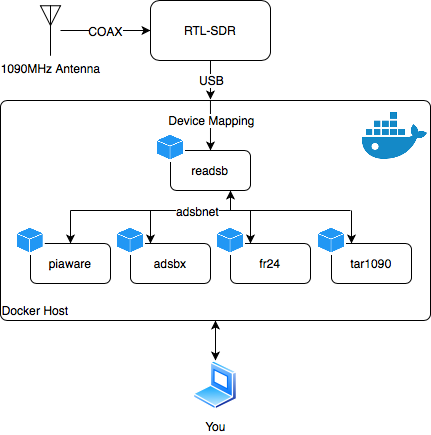

# Overview

This document aims to guide you through:

* **Receiving** ADSB data with [`adsb-ultrafeeder`](https://github.com/sdr-enthusiasts/docker-adsb-ultrafeeder)
* **Feeding** data to online services using [`adsbexchange`](https://github.com/sdr-enthusiasts/docker-adsbexchange), [`piaware`](https://github.com/sdr-enthusiasts/docker-piaware), [`fr24feed`](https://github.com/sdr-enthusiasts/docker-flightradar24) and others...
* **Storing** data in a time series database such as [InfluxDB](https://docs.influxdata.com/influxdb/) or [Prometheus](https://prometheus.io/)
* **Visualising** data with various tools such as [`tar1090`](https://github.com/sdr-enthusiasts/docker-tar1090) and [Grafana](https://grafana.com)

...whilst also building a basic understanding of Docker.

The core set of containers consists of: [`adsb-ultrafeeder`](https://github.com/sdr-enthusiasts/docker-adsb-ultrafeeder), one or more feeder containers and [`tar1090`](https://github.com/sdr-enthusiasts/docker-tar1090). This will provide you with:

* ADS-B reception via `ultrafeeder`
* Feeder containers to feed your preferred services
* Local visualisation of ADS-B and MLAT data with `tar1090`

These are deployed \(in conjunction with RTL-SDR hardware\) as follows:

To explain the flowchart above:

* ADS-B transmissions are received via the 1090MHz antenna and RTL-SDR dongle
* The RTL-SDR dongle device is mapped through to a `ultrafeeder` container, this container's function is to decode the ADS-B transmissions and makes them available via several protocols \(BaseStation, Beast, BeastReduce, raw, VRS\)
* There are then three feeder containers:
  * `piaware` - this container reads Beast protocol data from `ultrafeeder` and submits flight data to the [FlightAware](https://flightaware.com) service, and get their "Enterprise" feature set in return.
  * `adsbx` - this container reads Beast protocol data from `ultrafeeder` and submits flight data to the [ADSBExchange](https://www.adsbexchange.com) service.
  * `fr24` - this container reads Beast protocol data from `ultrafeeder` and submits flight data to the [FlightRadar24](https://www.flightradar24.com) service, and get their "Business Plan" in return.
* Flight data is visualised using `tar1090`, presenting a web interface allowing you to view the flight data received by you set-up in real time.

There are other feeder packages available \(eg: Plane.watch, OpenSky Network, Radarbox, etc\) that you may wish to consider too. They are all explained in this document.

There are also other visualisation packages available \(eg: FlightAirMap/VirtualRadarServer/Grafana\) that you may wish to consider, however keep in mind that these may require more horsepower than a humble Raspberry Pi can provide. `tar1090` is very lightweight which is why it is recommended here.

All of the containers in this guide will run on:

* `linux/amd64` \("modern" Intel/AMD PCs/servers\)
* `linux/arm/v7` \(Most Raspberry Pis operating systems\)
* `linux/arm64` \(Raspberry Pis running 64-bit operating systems\)

This mix of architectures allows you to run this set-up this on almost any Linux machine.

If there's another feeder you'd like added as a container, please reach out to me via the methods outlined below.

# Shortcuts

Following this guide is not very hard, but it does require some familiarity with the command line, editing files, and some patience as you work through the details.
If you are looking for an easier option, the [How To Get Help](intro/how-to-get-help) section introduces the [adsb.im Feeder Image](https://adsb.im/home) which is designed to make things even easier.

